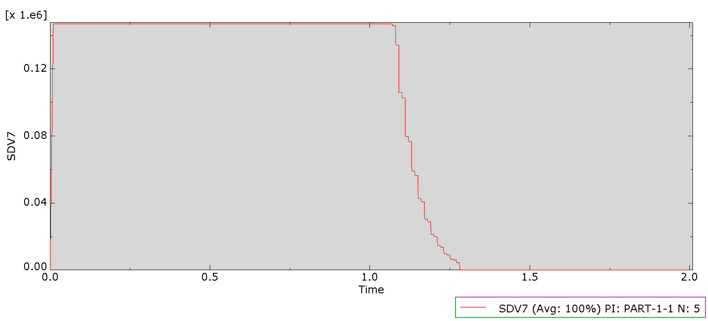
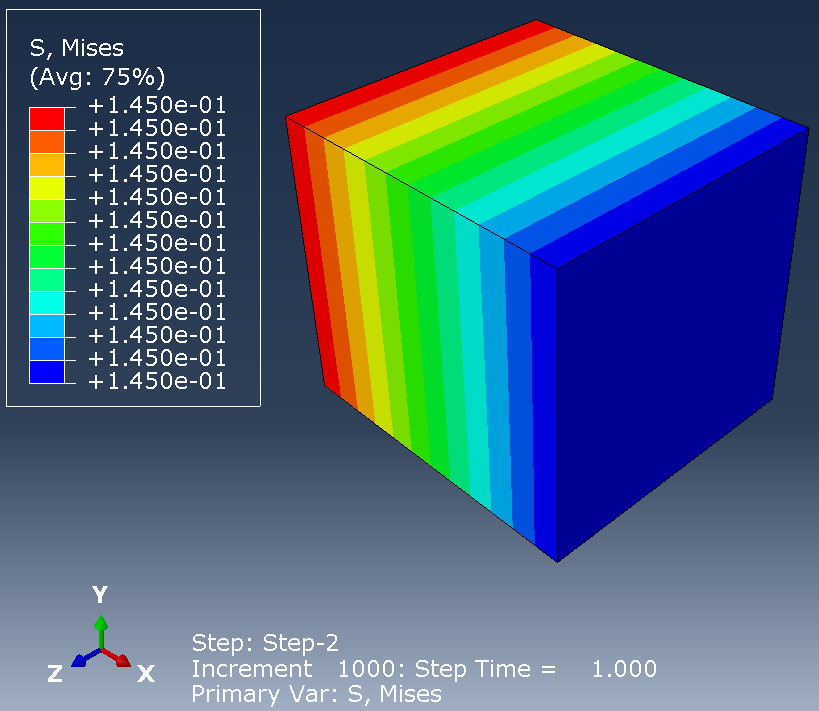
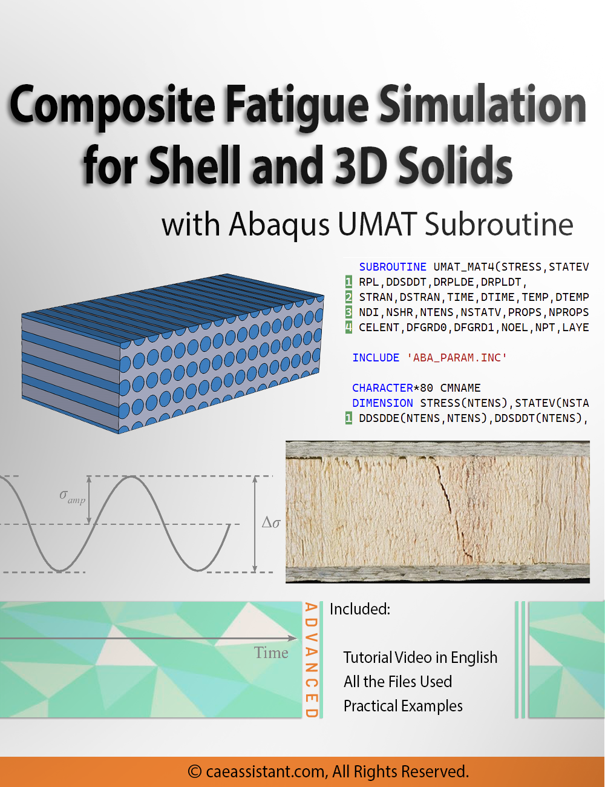

# Abaqus-CAE-UMAT-subroutine-for-3D-Composite-fatigue-simulation
In this project, we modeled the fatigue behavior of a composite material in 3D space using the UMAT subroutine in Abaqus. The Abaqus .inp file and part of the UMAT subroutine are provided.

Fatigue refers to the degradation or failure of a material due to repetitive or fluctuating stresses over time, even when the stress levels are lower than the material's ultimate tensile strength. It is the process by which a material deteriorates or fractures after experiencing multiple cycles of loading and unloading or continuous loading.

  

In composite materials, fatigue can cause various issues that impact the material's performance and lifespan. The main effects of fatigue in composites include:
1-Crack Formation
2-Delamination
3-Fiber Fracture
4-Matrix Cracking
5-Reduced Stiffness
And more
Understanding how fatigue impacts composites is essential for industries like aerospace, automotive, and civil engineering, where long-term durability and performance are critical. Engineers often optimize composite designs for better fatigue resistance by selecting suitable materials, arranging the layers strategically, and using protective measures such as coatings or reinforcements.

The Finite Element Method (FEM) is an essential tool in analyzing fatigue behavior and designing composite materials to reduce damage. However, using FEM software for fatigue analysis in composites remains complex and challenging.

  

To tackle this challenge, our project utilizes the UMAT subroutine in Abaqus, written in Fortran, to examine fatigue in composites within a three-dimensional framework. We offer a comprehensive training package for this project, which includes detailed video tutorials and downloadable modeling files. You can access this package on our website.

  

